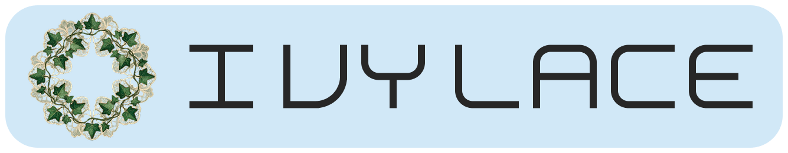

<p align="center">
  
</p>

Multiband glue compressor with per-band analog saturation.
Built with [nih-plug](https://github.com/robbert-vdh/nih-plug) (Rust).

## Features

### Compressor (SSL 4000G-style)
- **VCA feed-forward topology** with program-dependent auto-release
- **Stepped controls** matching SSL hardware:
  - Attack: 0.1 / 0.3 / 1 / 3 / 10 / 30 ms
  - Release: 100 / 300 / 600 / 1200 ms + Auto
  - Ratio: 2:1 / 4:1 / 10:1
- **Sidechain HPF** per band (the key to "glue" compression)
- **Soft knee** that adapts to ratio setting
- **Parallel compression** via global dry/wet mix
- **Band threshold linking**

### 4-Band Crossover
- **Linkwitz-Riley 4th order (LR4, 24dB/oct)** for phase-coherent band splitting
- Adjustable crossover frequencies:
  - Low: 30-500 Hz (default: 120 Hz)
  - Mid: 200-5000 Hz (default: 1500 Hz)
  - High: 2000-18000 Hz (default: 8000 Hz)
- Draggable crossover handles in GUI

### Analog Saturation
- **Three saturation models:**
  - **Console:** Subtle transformer/op-amp coloring, even harmonics
  - **Tube:** Asymmetric soft clipping, warm even harmonics
  - **Tape:** Symmetric saturation with natural compression, odd harmonics
- **Per-band drive control** with auto-gain compensation
- **Low band bypass by default** — keeps sub-bass clean for EDM production
- DC blocker on each band to prevent DC offset from asymmetric clipping
- **2x/4x oversampling** for anti-aliased saturation

### GUI
- **Dark / Glass dual theme** — switchable via header toggle, persisted per session
  - Dark: purple-tinted glassmorphism with gradient background
  - Glass: sky blue (#89c3eb) tinted light theme with near-white background
- **Custom GPU-rendered widgets** — glassmorphism knobs, GR meters (digital bar + analog needle gauge), crossover display
- **Analog needle GR meter** — semicircular VU-style gauge per band with VU-like ballistics
- **Delta spectrum analyzer** — real-time pre/post difference display (cut=blue, boost=orange), ±6dB range
- **Delta monitor** — audition wet−dry difference via header toggle
- **About dialog** — click title bar to view logo, version, and author info (theme-dependent logo)
- **DAW bypass support** — VST3 bypass button (Cubase, etc.)
- **Resizable window** (960 x 820 default)

### Band Layout
| Band | Range | Default Saturation |
|------|-------|--------------------|
| Low | DC — 120 Hz | **OFF** (EDM-friendly) |
| LowMid | 120 — 1500 Hz | Console, Drive 0.3 |
| HighMid | 1500 — 8000 Hz | Console, Drive 0.4 |
| High | 8000 Hz — Nyquist | Console, Drive 0.3 |

## Signal Flow

```
Input → Input Gain
  → LR4 Crossover (4 bands)
  → [Per Band] → Compressor → Saturation (oversampled)
  → Sum bands
  → Dry/Wet Mix
  → Output Gain
```

## Build

```bash
# VST3 + CLAP bundle
cargo xtask bundle ivylace --release
```

Requires Rust stable 1.75+.

## Plugin Formats

- **VST3** (compatible with FL Studio, Ableton, Cubase, etc.)
- **CLAP** (Bitwig, REAPER, etc.)

## Architecture

```
src/
├── lib.rs                  # Plugin entry point, parameters, process()
├── editor/                 # VIZIA GUI (custom widgets, femtovg drawing)
│   ├── mod.rs              # Editor entry, Data lens model, title bar, background gradient
│   ├── theme.rs            # ~45 color functions, Dark/Glass dual theme
│   ├── knob.rs             # GlassKnob rotary control (3 sizes)
│   ├── meter.rs            # GR meters: digital bar + analog needle gauge
│   ├── crossover.rs        # Crossover frequency display with draggable handles
│   ├── segmented.rs        # Stepped enum control (Ratio/Attack/Release/Sat Type/OS)
│   ├── toggle.rs           # Toggle button (LINK/Power/Solo/SAT)
│   ├── band_strip.rs       # Per-band strip layout
│   ├── header.rs           # Global controls bar + theme toggle + delta monitor
│   ├── spectrum.rs         # Delta spectrum analyzer (pre/post difference display)
│   └── about.rs            # About dialog overlay (theme-dependent logo)
├── dsp/
│   ├── mod.rs
│   ├── crossover.rs        # LR4 4-band crossover
│   ├── compressor.rs       # SSL 4000G-style VCA compressor
│   ├── saturation.rs       # Per-band analog saturation (Console/Tube/Tape)
│   ├── oversampling.rs     # 2x/4x oversampling (halfband FIR, zero-stuffing)
│   ├── gr_meter.rs         # Gain reduction metering (lock-free)
│   └── spectrum.rs         # FFT + lock-free spectrum buffer
└── assets/
    └── noto_sans_jp_kana.ttf  # Japanese font subset for About dialog
```

## License

MIT
